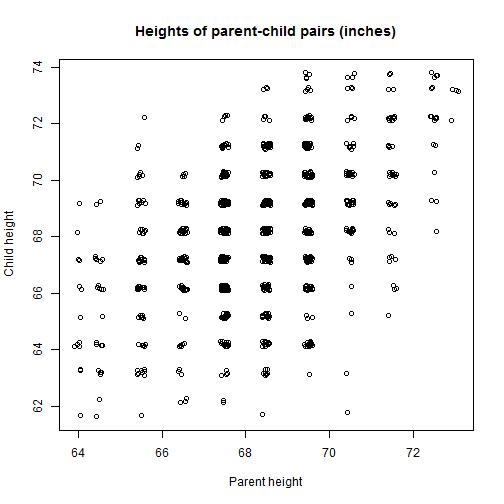

## Data used

The data set used to make the prediction application contains the height in inches of combinations of parent and child. This makes it possible for the app to use the height of the parent to predict the height of that parent's child.

From the data documentation:

"Data set from tabulated data set used by Galton in 1885 to study the relationship between a parent's height and their childrens. In the data there are 205 different parents and 928 children."

Source: UsingR package in R.

---

## Overview of the data
 

This graph indicates a positive correlation between the height of child and parent.

---

## Parent height as predictor

The table beneath shows that the parent's height (parent) indeed has a significant positive correlation with the child's height (very low P-value). Hence it can be used as a predictor.


```
##               Estimate     Pr(>|t|)
## (Intercept) 23.9415302 6.536845e-17
## parent       0.6462906 1.732509e-49
```

In other words: if the parent is 1 inch taller, the child is expected to be 0.65 inches taller.

---

## Lastly: gender matters

From the data documentation:

"The midparent's height is an average of the fathers height and **1.08 times the mother's**."

Therefore the app also distinguishes between the gender of the parent for the prediction. When the user enters the height of a female parent, this gets multiplied by 1.08 by the prediction model.
